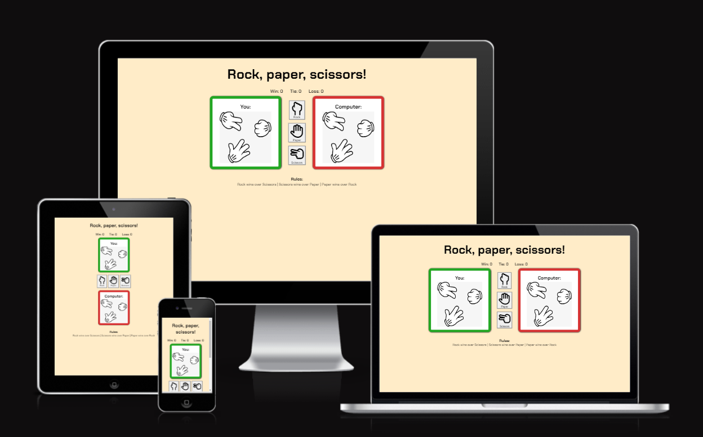
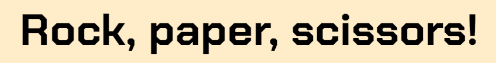
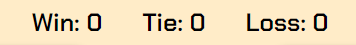
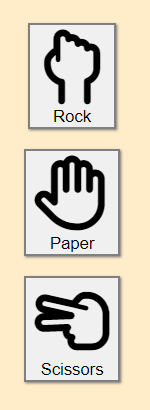
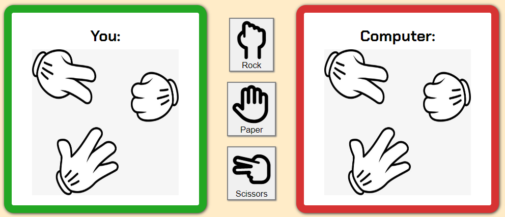
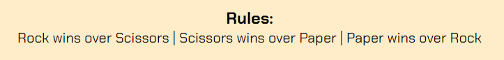
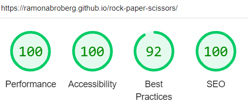

# Rock, paper, scissors

This website gives you the opportunity to play rock, paper, scissors against your electronic device. The website's purpose is to give you a good time and for you to learn more about the game rock, paper, scissors. This website is perfect if you want to challenge a friend or family member to see which one of you that can get the most wins of the amount of turns that you decide.

The layout is easy to read and you will see how the score develops during the time you play, both as wins, draws and losses.  You can also see the rules for the game at the bottom of the page even though it's a classic game that's been around for a long time so most people do know how to play it.

#### You can find the project live [here](https://ramonabroberg.github.io/rock-paper-scissors/)

## Features

### Existing features

- #### Header
  
  - The header is located at the top of the page.
  - It has a nice font that reminds you of the gaming world.
  - It is easy to understand the purpose of the website.

- #### Scoreboard
  
  - Under the header you can see the scoreboard that shows number of wins, draws and losses.

- #### Game options
  
  - Here you have three buttons you click on to choose which game option you want to use. You can choose between rock, paper or scissors.
  - When you click on your choice the computer will automatically respond with a choice itself. This will determine if it's a win, loss och draw.
  - The buttons have text but also icons to clearly show what they stand for and of course also for the aesthetic itself.

- #### Game area
  
  - When the player clicks on a game option button it automatically shows the image of that choice as a result.
  - At the same time as the button is clicked, it also generates a random choice from the computer that appears as an image on the computer's side of the screen.
  - The choices are compared and then displayed as a result on the scoreboard which will continue to add up until you refresh the page.

  
- #### Footer
  
  - The footer shows the rules for the game if a player never has played the game before.

### Features left to implement

- I would like to continue to develop the functions and make it more advanced but I feel like this was a great starting point as my first javascript project.

## Testing

- I have tested the game in different browsers; Google Chrome, Microsoft Edge and Mozilla Firefox.
- I have seen that the game result shows correct.
- The images shows correctly for the different options.
- All the elements are easy to read and have good contrast.
- The website looks good on different screen sizes.
- Results of Lighthouse from DevTools:

### Validator testing

- HTML
  - No errors were returned when passed through the W3C Validator.
- CSS
  - No errors were returned when passed through the Jigsaw validator.

### Bugs

#### Solved bugs

- When adding favicon I noticed that they didn't show on the website. I realised that I hadn't added the full path to the files since it was their standardlinks and my files are located in a foldder so by adding the correct path I fixed the problem.
- I didn't think about to start to style the website from mobile size which I realised when I was done so the layout didn't look good on smaller devices. I fixed it by adding a media query for smaller sizes so I didn't have to change a majority of my code.

#### Unfixed bugs

No unfixed bugs known.

## Deployment

#### The site was deployed to Git Hub pages using the following steps

- In the Github repository, click on the Settings tab.
- Under General, navigate to Code and Automation and select 'Pages'.
- In the Build and Deployment section for Source, select 'Deploy from a branch' from the drop-down list.
- For Branch, select 'main' from the drop-down list and Save.
- On the top of the page, the link to the complete website is provided.
- The deployed site will update automatically upon new commits to the master branch.

## Credits

#### Content

- Inspiration was taken from Code Institute's projects: "Love Maths" and "Rock, paper, scissors".
- Inspiration for the readme file was taken from Code Institute's readme file of "Rock, paper, scissors".

#### Media

- The icons are taken from [Font Awesome](https://fontawesome.com/).
- The fonts are taken from [Google Fonts](https://fonts.google.com/).
- The image of the hand gestures were taken from [Pinterest](https://www.pinterest.se/pin/747879081845727421/).
- The favicon was made using [Favicon](<https://favicon.io/>).
  